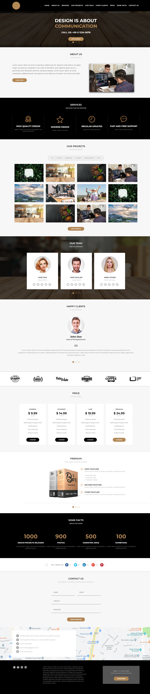

  

<h1 align="center">Awax</h1>

<h4 align="center">Finalizado 🚀</h4>

Projeto prático do curso <a href="https://alunos.b7web.com.br/curso/html5-e-css3/o-que-e-html-e-pra-que-serve">B7Web</a>

## Índice

- [Visão geral](#visão-geral)
  - [O desafio](#o-desafio)
  - [Links](#links)
- [Meu processo](#meu-processo)
  - [Criado com](#integrado)
  - [O que aprendi](#o-que-aprendi)
  - [Recursos úteis](#recursos-úteis)
- [Licença](#licenc-a)
- [Autor](#autor)

## Visão geral

### 🔥 O desafio

Os usuários devem ser capazes de:

- Veja o layout ideal, dependendo do tamanho da tela do dispositivo
- Ver estados de foco para elementos interativos

## Meu processo

### 🛠 Construído com

- Marcação HTML5 semântica
- propriedades CSS
- Flexbox
- Media queries

### 📖 O que eu aprendi

Eu aprendi a fazer um slide com HTML e CSS, além de dicas sobre organização de pastas.

### 💘 Recursos úteis

- [Flexbox Froggy](https://flexboxfroggy.com/) - Esse jogo me ajudou a entender como funciona o Flexbox.
- [Guia Flexbox](https://origamid.com/projetos/flexbox-guia-completo/) - Este é um artigo incrível que me ajudou a entender o Flexbox. 

## 📝 Licença 
Este projeto está sob a licença do MIT. Consulte a [LICENSE](https://github.com/lukemorales/react-native-design-code/blob/master/LICENSE) para obter mais informações.

## 🦸‍♀️ Autor 
<a href="https://github.com/tawaramartins">Tawara Martins</a>. 
 
